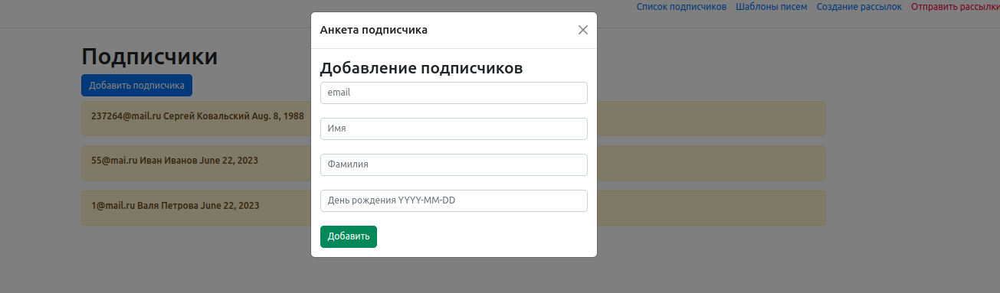
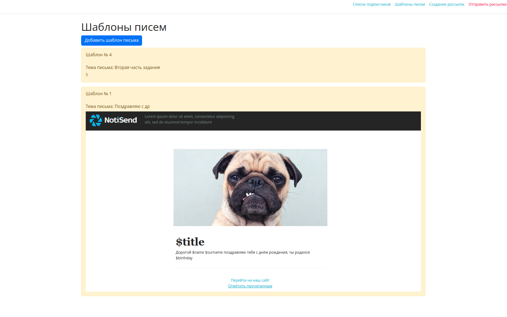
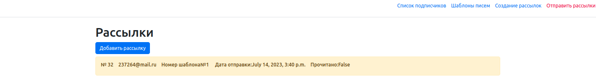
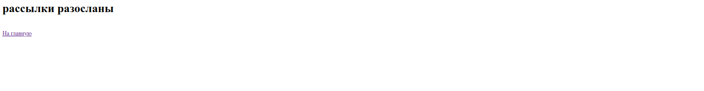

Python / Django небольшой сервис отправки имейл рассылок. Используется Python 2.7.

Возможности сервиса:

1. Отправка рассылок с использованием html макета и списка подписчиков.

2. Для создания рассылки используется ajax запрос. Форма для создания рассылки заполняется в модальном окне. Использовать библиотеки: jquery, bootstrap.

3. Отправка отложенных рассылок.

4. Использование переменных в макете рассылки. (Пример: имя, фамилия, день рождения из списка подписчиков)

5. Отслеживание открытий писем.

6. Отложенные отправки реализованы при помощи Celery.

Для установки необходим установленный Redis, Celery: 
1.Склонируйте репозиторий 
2.Установите зависимости requirements.txt 
3.Разместите .env рядом с manage.py 
4. Добавьте в него c Вашими настройками 

        SECRET_KEY=
        DEBUG=True
        EMAIL_HOST=
        EMAIL_PORT=
        EMAIL_HOST_USER=
        EMAIL_HOST_PASSWORD=
        EMAIL_USE_TLS=True
        ELSEVIER_API_KEY=api_key
5. Проведите миграции 
6. Запустите в разных терминалах: 
-redis-server 
-celery -A mailganer worker -l info 
-celery -A mailganer beat 

5. Программа будет рассылать неотправленные письма каждые 10с

